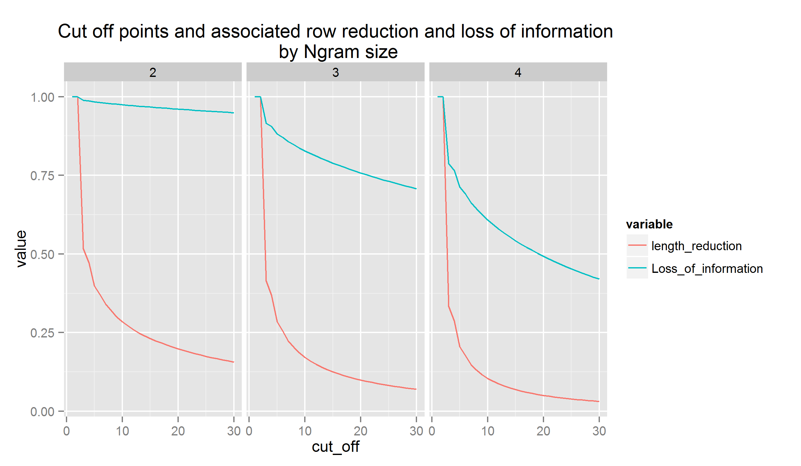
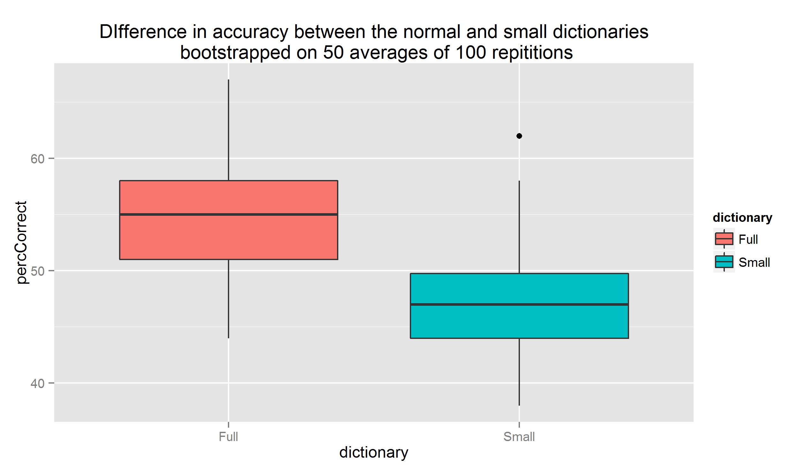

Capstone Presentation
========================================================
author: Jonathan Bourne
date: 09/12/14

Introduction
========================================================

Description of the Algorithm

The prediction algorithm, is a list of Ngram dataframes. When the target phrase is entered each Ngram dataframe is filtered to only relevant responses. All responses are then combined into a single dataframe and ranked according to Ngram with a tie braker on predictive power, the highest ranked result is then returned.

Description of the App

The app is simply the practical application of the algorithm it allows the phrase to be entered on the left side panel, then returns the suggested response, the the entire phrase with prediction, and any alternative options (in the form of a table)

Dealing with unknown words and Expressions
========================================================

NGram models can only predict the next word if they have seen that exact phrase previously, if the last word in the phrase is unknown no prediction is possible. In order to deal with this situation a '[blank] Ngram' model is used in conjunction with the normal model.
The blank structure that has been chosen is as follows

- word [blank] word
- word [blank] [blank]
- [blank]

The blanks model is created using the normal dictionary the code for which can be seen on github.

Data Compression
========================================================

Data compression was chosen by examening graphs of the cut off points for the ngram models this allowed a concious decision on the trade off between size and information.

Testing predictive power
========================================================

Testing the predictive accuracy of the model over 5000 samples showed that using the base dictionary and the base blanks dictionary gives a predictive power of 55% compared to using the compressed versions of the dictionaries which gives a predictive power of 47% The difference was significant at the p0.95 confidence level. 

***
 This change of 14% comes with a size saving of 87%. As a result the smaller dictionaries were used in the final shiny app.

 

